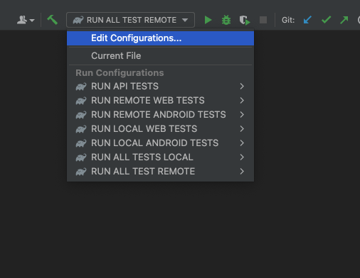

# Демо проект для автоматизации сервиса доставки еды [DOSTAЕВСКИЙ](https://dostaevsky.ru/)


> Dostaevsky (Достоевский) — популярная служба для заказа еды, работающая в нескольких городах России.\
> Через сервис можно заказать любые блюда азиатской, русской, европейской кухонь из предложенных в вашем городе ресторанов и кафе.

# <a name="Описание">Описание</a>
Тестовый проект состоит из WEB-тестов, API-тестов и тестов для мобильного устройства на базе (Android).\
Краткий список интересных фактов о проекте:
- [x] В проекте применён шаблон проектирования `Page Object`
- [x] В проекте используются параметризованные тесты
- [x] Проект сконфигурирован с использованием библиотеки `Owner`
- [x] Использован `Lombok` для описания моделей API запросов/ответов
- [x] Добавлен кастомный `Allure listener` для визуализации запросов/ответов API в отчёте
- [x] Добавлена интеграция с `Allure TestOps`
- [x] Добавлена интеграция с `Jira`
- [x] Тесты запускаются в `Jenkins` с выбранными параметрами 

# <a name="Технологии и инструменты">Используемые технологии и инструменты</a>

<p  align="center">
  <code></code>
  <code></code>
  <code></code>
  <code></code>
  <code></code>
  <code></code>
  <code></code>
  <code></code><br>
  <code></code>
  <code></code>
  <code></code>
  <code></code>
  <code></code>
  <code></code>
  <code></code>
  <code></code>
</p>
<br>

Автотесты в проекте написаны на `Java`.

`Gradle` - используется, как инструмент для сборки проекта.  \
`JUnit5` - используется для запуска тестов.\
`Selenide` - используется для автоматизации UI WEB.\
`REST Assured` - используется для тестирования API сервисов REST.\
`Jenkins` - используется для удаленного запуска тестов.\
`Selenoid` - используется для удаленного запуска браузера в `Docker` контейнере.\
`Browserstack` - используется для удаленного запуска мобильных тестов.\
`Android Studio tools`, `Appium Server` - используются для локального запуска мобильных тестов.\
`Allure Report` - используется для визуализации отчета о тестировании.\
`Telegram Bot` - используется для уведомления о результатах прогона тестов.\
`Allure TestOps` - используется, как репозиторий для хранения тестов.


# <a name="Как запустить">Как запустить тесты</a>

## <a name="GradleCommand">Gradle команды</a>
Для запуска локально и в Jenkins используется следующая команда:
```bash
gradle clean ${CATEGORY} -Denv=<env>
```
В `CATEGORY` представлен список из тэгов для запуска определенного типа тестов:
>- *api*
>- *web*
>- *android*

Дополнительно добавлена возможность запуска всех тестов локально и удаленно через задачи
>- *allRemoteTests*
>- *allLocalTests*

`env` - определяет среду для запуска тестов _(не относится к API)_:
>- *local*
>- *remote*

## <a name="Конфигурационные файлы">Конфигурационные файлы</a>
Возможные конфигурации окружения для тестов в проекте описаны в файлах `*.properties`\
Значения и параметры в файлах зависят от локального или удаленного запуска тестов\
Ниже представлен пример параметров, которые используются для WEB тестов
```properties
browser_name=...
browser_version=...
browser_size=...
selenoid_url=...
```

>- *browser_name* - Имя запускаемого браузера
>- *browser_version* - Версия запускаемого браузера
>- *browser_size* - Разрешение в котором будет запущен браузер
>- *selenoid_url* - Ссылка для удалённого/локального запуска тестов в `Selenoid`

## <a name="Запуск тестов в IDEA">Запуск тестов в IDEA</a>
Для удобства запуска тестов в различных конфигурациях в проекте созданы конфигурации для IDEA
<p  align="center">

</p>