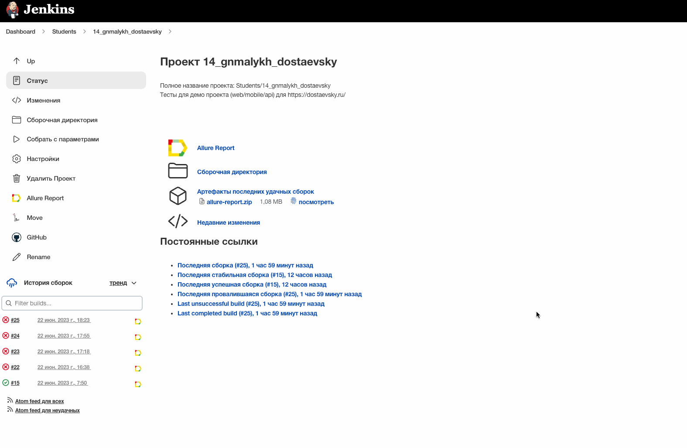
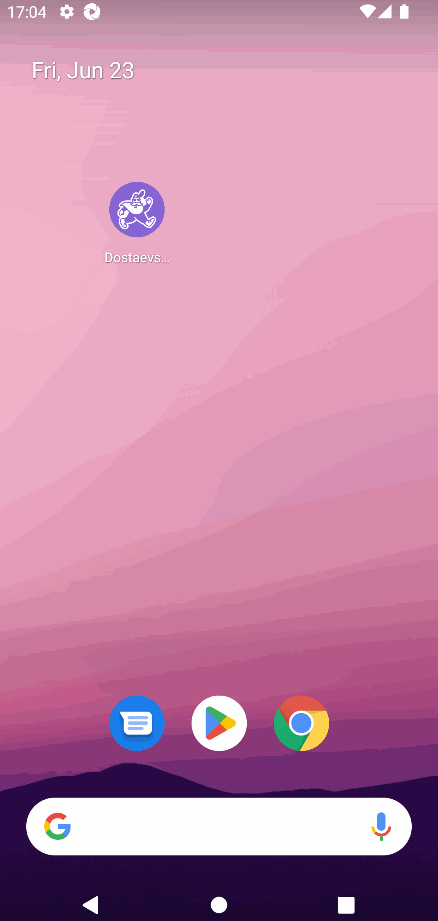

# Демо проект для автоматизации сервиса доставки еды [DOSTAЕВСКИЙ](https://dostaevsky.ru/)

<p align="left">
    
</p>

> Dostaevsky (Достоевский) — популярная служба для заказа еды, работающая в нескольких городах России.\
> Через сервис можно заказать любые блюда азиатской, русской, европейской кухонь из предложенных в вашем городе ресторанов и кафе.

# <a name="Описание">Описание</a>

Тестовый проект состоит из WEB-тестов, API-тестов и тестов для мобильного устройства на базе (Android).\
Краткий список интересных фактов о проекте:

- [x] В проекте применён шаблон проектирования `Page Object`
- [x] В проекте используются параметризованные тесты
- [x] Проект сконфигурирован с использованием библиотеки `Owner`
- [x] Использован `Lombok` для описания моделей API запросов/ответов
- [x] Добавлен кастомный `Allure listener` для визуализации запросов/ответов API в отчёте
- [x] Добавлена интеграция с `Allure TestOps`
- [x] Добавлена интеграция с `Jira`
- [x] Тесты запускаются в `Jenkins` с выбранными параметрами

# <a name="Технологии и инструменты">Используемые технологии и инструменты</a>

<p  align="center">
  <code></code>
  <code></code>
  <code></code>
  <code></code>
  <code></code>
  <code></code>
  <code></code>
  <code></code><br>
  <code></code>
  <code></code>
  <code></code>
  <code></code>
  <code></code>
  <code></code>
  <code></code>
  <code></code>
</p>
<br>

Автотесты в проекте написаны на `Java`.

`Gradle` - используется, как инструмент для сборки проекта.  \
`JUnit5` - используется для запуска тестов.\
`Selenide` - используется для автоматизации UI WEB.\
`REST Assured` - используется для тестирования API сервисов REST.\
`Jenkins` - используется для удаленного запуска тестов.\
`Selenoid` - используется для удаленного запуска браузера в `Docker` контейнере.\
`Browserstack` - используется для удаленного запуска мобильных тестов.\
`Android Studio tools`, `Appium Server` - используются для локального запуска мобильных тестов.\
`Allure Report` - используется для визуализации отчета о тестировании.\
`Telegram Bot` - используется для уведомления о результатах прогона тестов.\
`Allure TestOps` - используется, как репозиторий для хранения тестов.

# <a name="Как запустить">Как запустить тесты</a>

## <a name="GradleCommand">Gradle команды</a>

### Запуск отдельных типов тестов

Для запуска локально и в Jenkins используется следующая команда:

```bash
gradle clean ${CATEGORY} -Denv=<env>
```

В `CATEGORY` представлен список из тэгов для запуска определенного типа тестов:
> - *api* - API тесты
>- *web* - Web тесты  
>- *android* - Android тесты

### Запуск всех тестов

Дополнительно добавлена возможность запуска всех тестов локально и удаленно через задачи:

```bash
# Запуск всех тестов удаленно (параллельно)
./gradlew runAllTestsRemote

# Запуск всех тестов локально (последовательно)
./gradlew runAllTestsLocal
```

**Описание задач:**
> - *runAllTestsRemote* - запуск всех тестов удаленно (API + Web + Android) с настройкой `env=remote` **параллельно**
>- *runAllTestsLocal* - запуск всех тестов локально (Android → Web → API) с настройкой `env=local` **последовательно**

`env` - определяет среду для запуска тестов _(не относится к API)_:
> - *local*
>- *remote*

## <a name="Конфигурационные файлы">Конфигурационные файлы</a>

Возможные конфигурации окружения для тестов в проекте описаны в файлах `*.properties`\
Значения и параметры в файлах зависят от локального или удаленного запуска тестов\
Ниже представлен пример параметров, которые используются для WEB тестов

```properties
browser_name=...
browser_version=...
browser_size=...
selenoid_url=...
```

> - *browser_name* - Имя запускаемого браузера
>- *browser_version* - Версия запускаемого браузера
>- *browser_size* - Разрешение в котором будет запущен браузер
>- *selenoid_url* - Ссылка для удалённого/локального запуска тестов в `Selenoid`

## <a name="Запуск в Jenkins">Запуск тестов в [Jenkins](https://jenkins.autotests.cloud/job/C14_gnmalykh_dostaevsky_java/)</a>

> Ссылка доступна только авторизованным пользователям.

Главная страница сборки:
<p  align="center">

</p><br>

Параметризованный запуск тестов в Jenkins можно выполнить с указанной категорией тестов из списка ***CATEGORIES***:
<p  align="center">

</p><br>

После завершения сборки результаты тестирования доступны в:
> - <code><strong>*Allure Report*</strong></code>
>- <code><strong>*Allure TestOps*</strong></code> _(результаты загружаются автоматически)_
>- сообщении от <code><strong>*Telegram-бота*</strong></code>

<p  align="center">

</p>

# <a name="AllureReport">Результаты автотестов в [Allure Report](https://jenkins.autotests.cloud/job/C14_gnmalykh_dostaevsky_java/allure/#)</a>

> Ссылка доступна только авторизованным пользователям.

## Главная страница

Главная страница отчета Allure содержит следующие блоки:

> - <code><strong>*ALLURE REPORT*</strong></code> - отображает дату и время теста, общее количество запущенных тестов, а
    также диаграмму с процентом и количеством успешных, упавших и сломавшихся в процессе выполнение тестов
>- <code><strong>*TREND*</strong></code> - отображает тенденцию выполнения тестов для всех запусков
>- <code><strong>*SUITES*</strong></code> - отображает распределение тестов по наборам
>- <code><strong>*CATEGORIES*</strong></code> - отображает распределение неудачных тестов по типам дефектов
<p align="center">
  
</p><br>

## Список тестов с шагами и тестовыми артефактами

В отчете для каждого теста отображается подробная информация с выполненными шагами.\
Может быть показана полная информация о каждом тесте: теги, серьезность, продолжительность, и пр.

<p align="center">
  
</p>

Также доступны дополнительные тестовые артефакты:
> - Скриншоты
>- Исходный текст страницы
>- Видео теста
>- Ссылка на полную информацию о тесте Browserstack _(Для Android тестов)_

### Запись теста для WEB
<p  align="center">

</p><br>

### Запись теста для Android
<p  align="center">

</p><br>

# <a name="AllureTestOps">Интеграция с [Allure TestOps](https://allure.autotests.cloud/project/3433/dashboards)</a>

> Ссылка доступна только авторизованным пользователям.

Тест-кейсы в проект импортируются и постоянно обновляются из кода,
поэтому нет необходимости в сложном процессе синхронизации ручных тест-кейсов и автотестов.\
Достаточно создать и обновить в коде автотест, и тест-кейс в TMS всегда будет в актуальном состоянии.\
Ручные тест-кейсы также могут быть добавлены в TMS в случае необходимости (через веб-интерфейс или через код).
<p align="center">
  
</p>

# <a name="AllureTestOps">Интеграция с [Jira](https://jira.autotests.cloud/browse/HOMEWORK-768)</a>

> Ссылка доступна только авторизованным пользователям.

Результаты прогона тестов отображаются в `Jira` с отображением статуса теста и возможность просмотра его деталей.\
Так же из задачи в `Jira` доступна навигация к тестам `Allure TestOps`.
<p align="center">
  
</p>

# <a name="Уведомления в Telegram">Интеграция с [Telegram-ботом](https://t.me/gm_allure_not_bot)</a>

Дополнительно к `Allure Report` и `Allure TestOps` в проект добавлена интеграция с Telegram-ботом, который отправляет
краткий отчет в указанный чат по результатам каждой сборки.
<p  align="center">

</p>
